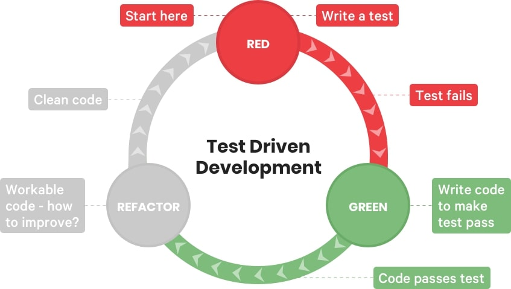

# Python TDD



#### What is Test Driven Development
Test Driven Development is a test-first software development process of writing tests before writing code. 

It's aim is to make development faster and more reliable. Test Driven Development incorporates three activities: 

- Coding
- Testing (in the form of writing Unit Tests)
- Design (in the form of Refactoring)

#### Test Driven Development Benefits 
The benefits of Test Driven Development are primarily fewer bugs as defects are caught earlier on. 

### Create a file - tdd_file1
````python
import unittest

from calc import Simplecalc
import unitest
import pytest

class Caltests(unittest.TestCase):
    calc_obj = Simplecalc()

    def test_add(self):
        self.assertEqual(self.calc_obj.add(2, 4), 6)

    def test_subtract(self):
        self.assertEqual(self.calc_obj.subtract(4, 2), 2)

    def test_multiply(self):
        self.assertEqual(self.calc_obj.multiply(2, 3), 6)

    def test_divide(self):
        self.assertEqual(self.calc_obj.divide(6, 3), 2)
````

#### Refactor code to pass test
````python
class Simplecalc:
    
    def add(self, value1, value2):
        return value1 + value2

    def subtract(self, value1, value2):
        return value1 - value2

    def multiply(self, value1, value2):
        return value1 * value2

    def divide(self, value1, value2):
        return value1 / value2
````

`run` python -m pytest -v